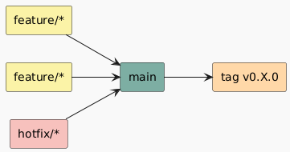
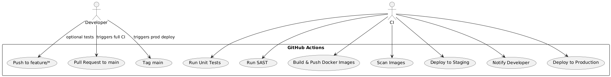

# 🚀 GitHub Branching Strategy

This repository follows **Trunk Based Development (TBD)** to enable rapid builds, quality delivery through automation, and frictionless feature flow. This strategy supports CI/CD for all frontend and backend services.



## 📂 Branch Types

| Branch         | Description                                                                              |
| -------------- | ---------------------------------------------------------------------------------------- |
| `main`         | The trunk. Holds stable deployable code. Protected. All other branches branch from here. |
| `staging`      | Pre-production code for testing before release.                                          |
| `hotfix/*`     | Short-lived branches from `main` for production-critical fixes.                          |
| `feat/*`       | Feature branches. Merged into `main` after testing and code review.                      |
| `experiment/*` | Used for PoCs or spikes. Not guaranteed to be merged.                                    |

---

## 🏷 Branch Naming Conventions

| Branch Type  | Naming Convention             | Example                          |
| ------------ | ----------------------------- | -------------------------------- |
| `feat`       | `feat/<jira-ticket>-<desc>`   | `feat/SC-123-add-login-form`     |
| `hotfix`     | `hotfix/<jira-ticket>-<desc>` | `hotfix/SC-456-fix-token-expiry` |
| `experiment` | `experiment/<desc>`           | `experiment/new-tiptap-renderer` |

---

## 🔀 Merge Rules

| Source     | Target    | Rule                                    |
| ---------- | --------- | --------------------------------------- |
| `hotfix/*` | `main`    | Must pass all tests                     |
| `feat/*`   | `main`    | PR must be reviewed and pass all checks |
| `main`     | `staging` | Manual merge after validation           |

---



## 📌 Release Strategy

- Sprint releases are tagged from `main` at the end of each sprint.
- Use **semantic versioning** for release tags (e.g., `v1.0.0`, `v1.1.0`).

```bash
# Tag and push a release
git tag -a v1.0.0 -m "Sprint 1 release"
git push origin v1.0.0
```
